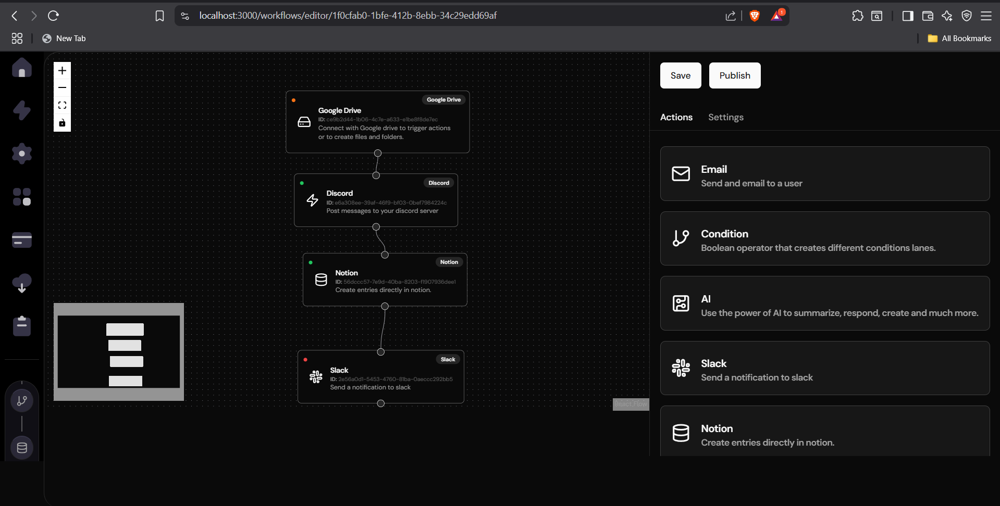
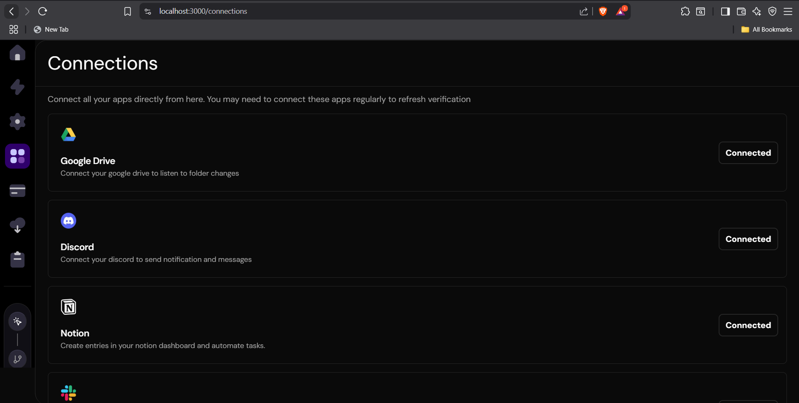
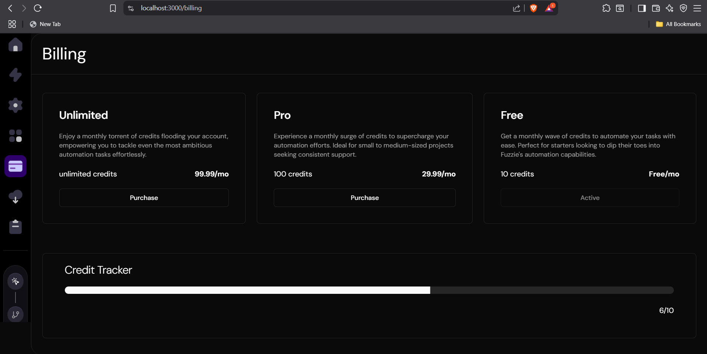
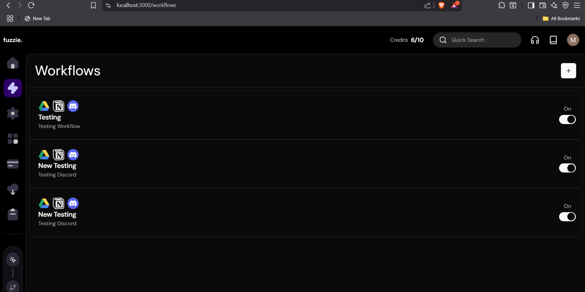

This is a [Next.js](https://nextjs.org/) project bootstrapped with [`create-next-app`](https://github.com/vercel/next.js/tree/canary/packages/create-next-app).

# 🚀 Fuzzie — Workflow Automation Builder  

Fuzzie is a flexible, modern **Workflow Automation Builder** that helps you connect apps, automate repetitive tasks, and streamline your processes — without writing code.  

## ✨ Features  
- Visual workflow builder  
- Multi-app triggers and actions  
- Clean, user-friendly interface  
- Real-time execution with error handling  
- Integrations with:  
  - Google Drive  
  - Slack  
  - Discord  
  - Notion  

## 🔧 Tech Stack  
- **Frontend:** Next.js 14, Tailwind CSS v4  
- **Authentication:** Clerk  
- **Database:** Neon Tech  
- **File Storage:** Uploadcare  
- **Tunnel:** Ngrok  
- **Payments:** Stripe  

## 📸 UI Preview  

## 📸 Screenshots

### 🏠 Homepage 


### 🧠 Workflow Builder – Drag & Drop Interface


### 🔗 App Connections – OAuth Linked Services


### ⚙️ Settings – User Profile Panel


### 💳 Pricing Page – Subscription Plans


### 📈 Workflows – Landing Section


### 🎥 Watch the Demo  
[Click here to watch UI](https://drive.google.com/file/d/1HfgfJzZKlIJ19wZtNfFwclISDa6s_YWv/view?usp=sharing)
[Click here to watch Working](https://drive.google.com/file/d/1YxFvT48Vktcf85gDSrN6H68CNMl2DEbf/view?usp=sharing)


### 1️⃣ Clone the Repository  
```bash
git clone https://github.com/mayurbhadange/Automation-Builder.git  
cd Automation-Builder

Here’s an example of how your .env.local file might look for Fuzzie:

# Clerk Authentication
CLERK_PUBLISHABLE_KEY=your-clerk-publishable-key
CLERK_SECRET_KEY=your-clerk-secret-key

# Neon Tech (PostgreSQL DB)
DATABASE_URL=your-neon-tech-postgres-url

# Uploadcare
UPLOADCARE_PUBLIC_KEY=your-uploadcare-public-key
UPLOADCARE_SECRET_KEY=your-uploadcare-secret-key

# Ngrok
NGROK_AUTH_TOKEN=your-ngrok-auth-token
NGROK_PUBLIC_URL=your-ngrok-url # Example: https://xyz123.ngrok.io

# Stripe
STRIPE_PUBLIC_KEY=your-stripe-public-key
STRIPE_SECRET_KEY=your-stripe-secret-key
STRIPE_WEBHOOK_SECRET=your-stripe-webhook-secret

# Google API (Drive)
GOOGLE_CLIENT_ID=your-google-client-id
GOOGLE_CLIENT_SECRET=your-google-client-secret
GOOGLE_REDIRECT_URI=https://fuzzie-kohl.vercel/api/auth/callback/google
GOOGLE_API_KEY=your-google-api-key

# Slack API
SLACK_CLIENT_ID=your-slack-client-id
SLACK_CLIENT_SECRET=your-slack-client-secret
SLACK_SIGNING_SECRET=your-slack-signing-secret
SLACK_BOT_TOKEN=your-slack-bot-token

# Discord API
DISCORD_CLIENT_ID=your-discord-client-id
DISCORD_CLIENT_SECRET=your-discord-client-secret
DISCORD_BOT_TOKEN=your-discord-bot-token
DISCORD_PUBLIC_KEY=your-discord-public-key

# Notion API
NOTION_API_KEY=your-notion-api-key
NOTION_CLIENT_ID=your-notion-client-id
NOTION_CLIENT_SECRET=your-notion-client-secret
NOTION_REDIRECT_URI=https://fuzzie-kohl.vercel/api/auth/callback/notion


First, run the development server:

```bash
npm run dev
# or
yarn dev
# or
pnpm dev
# or
bun dev
```

Open [http://localhost:3000](http://localhost:3000) with your browser to see the result (for local development).

You can start editing the page by modifying `app/page.tsx`. The page auto-updates as you edit the file.

This project uses [`next/font`](https://nextjs.org/docs/basic-features/font-optimization) to automatically optimize and load Inter, a custom Google Font.

## Learn More

To learn more about Next.js, take a look at the following resources:

- [Next.js Documentation](https://nextjs.org/docs) - learn about Next.js features and API.
- [Learn Next.js](https://nextjs.org/learn) - an interactive Next.js tutorial.

You can check out [the Next.js GitHub repository](https://github.com/vercel/next.js/) - your feedback and contributions are welcome!

## Deploy on Vercel

The easiest way to deploy your Next.js app is to use the [Vercel Platform](https://vercel.com/new?utm_medium=default-template&filter=next.js&utm_source=create-next-app&utm_campaign=create-next-app-readme) from the creators of Next.js.

Check out our [Next.js deployment documentation](https://nextjs.org/docs/deployment) for more details.


